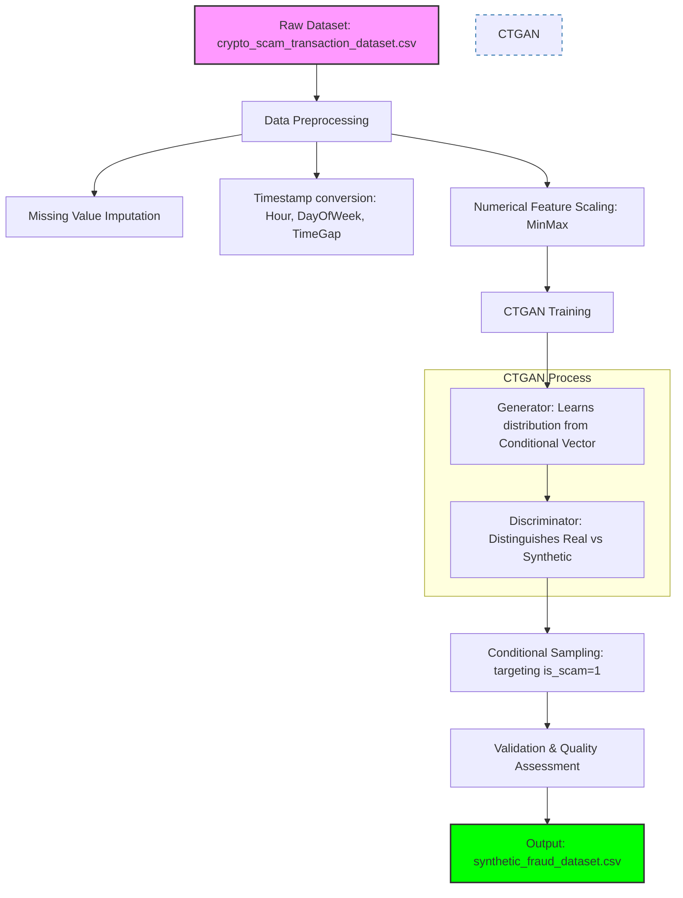
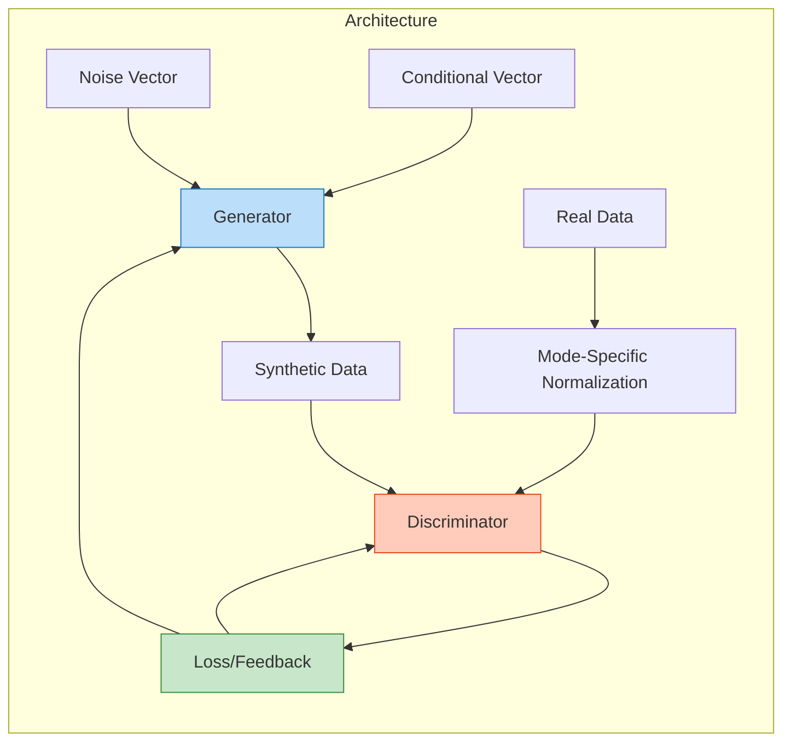

# Fraud Detection Synthetic Data Generation (Generator–Discriminator)

This project implements a pipeline to generate synthetic fraud transaction data using a Conditional GAN (CTGAN). The goal is to augment datasets with realistic synthetic samples, particularly focusing on fraudulent transactions (`is_scam = 1`).

## Project Overview

The core of this project is a Jupyter Notebook that performs the following steps:
1.  **Setup & Data Loading**: Installs necessary libraries and loads the `crypto_scam_transaction_dataset.csv`.
2.  **Data Preprocessing**:
    - Handles missing values (imputation).
    - Converts timestamps to usable features (hour, day of week, time gap).
    - Scales numerical features using MinMax scaling.
3.  **Model Training**: Trains a CTGAN (Conditional Tabular GAN) on the preprocessed data.
4.  **Synthetic Data Generation**: Generates synthetic samples, specifically targeting scam transactions.
5.  **Validation & Export**: Combines real and synthetic data, validates distributions, and exports the final dataset to `synthetic_fraud_dataset.csv`.

## Project Workflow

The following diagram illustrates the end-to-end pipeline for generating synthetic fraud data:




## CTGAN Architecture

This project utilizes Meta's **CTGAN (Conditional Tabular GAN)**, specialized for tabular data. It addresses common GAN challenges in tabular domains like non-Gaussian distributions and imbalanced categorical features.

### Core Components:
- **Generator**: A deep neural network that takes a noise vector and a conditional vector as input to produce synthetic rows.
- **Discriminator**: Evaluates synthetic samples against real samples, providing feedback to the generator.
- **Mode-Specific Normalization**: Handles complex numerical distributions by using Variational Gaussian Mixture models.
- **Conditional Vector & Training-by-Sampling**: Ensures that all categories in discrete columns are sampled evenly during training.



## Files

- `notebook.ipynb`: The main Jupyter Notebook containing the entire pipeline.
- `crypto_scam_transaction_dataset.csv`: The source dataset containing real transaction data.
- `synthetic_fraud_dataset.csv`: The generated output dataset (created after running the notebook).

## Dependencies

To run this project, you need the following Python libraries:

- `ctgan`
- `pandas`
- `numpy`
- `scikit-learn`
- `matplotlib`
- `seaborn`

You can install them via pip:

```bash
pip install ctgan pandas numpy scikit-learn matplotlib seaborn
```

## Usage

1.  Ensure you have the required dependencies installed.
2.  Open `notebook.ipynb` in Jupyter Notebook or JupyterLab.
3.  Run all cells sequentially.
4.  The script will train the model and generate a new file named `synthetic_fraud_dataset.csv` in the same directory.